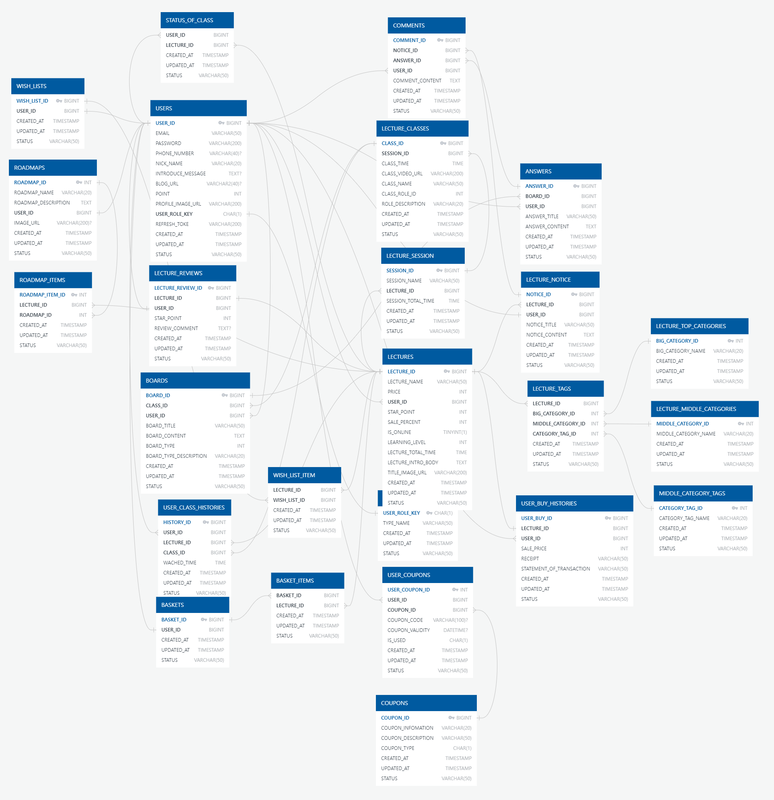
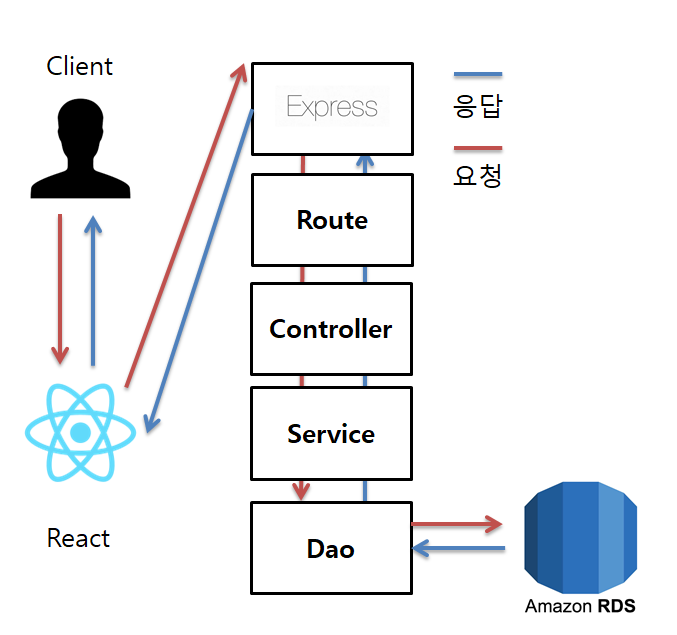
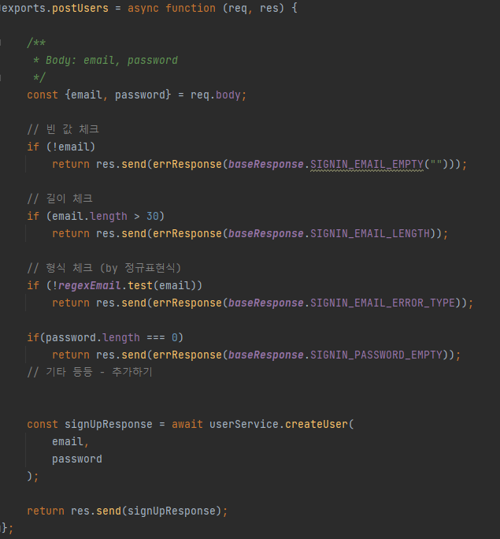
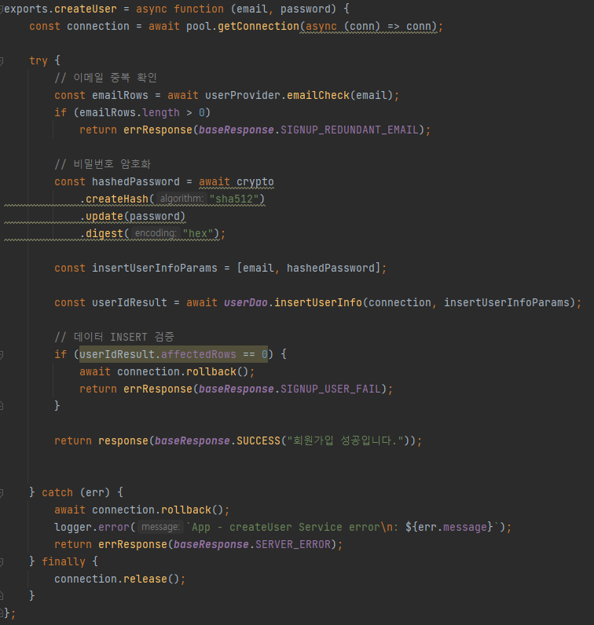
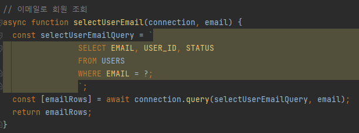

# inflearn_test_Server_Rio/Nadan

>인프런 클론 프로젝트: 
>리팩토링 진행중입니다.
 
📍[깃허브 링크](https://github.com/Junior-team/inflearn-clone2)
 

## 1. 제작 기간 & 참여 인원
- 2021년 10월 30일 ~ 11월 12일
- 팀 프로젝트
- Front-end: Dwell
- Back-end: Rio, Nadan
 

## 2. 사용 기술
`Back-end`
- Node.js
- express
- ffmpeg
- hls-server
- Mysql 8.0
- winston

`DevOps`
- pm2
- nginx
- AWS EC2
- AWS RDS
- git

`etc`
- jwt Token
- Oauth2
 

## 3. ERD 설계

## 4. 핵심 기능
이 서비스의 핵심 기능은 인프런의 강의 컨텐츠에 관련된 CRUD와
유저와 강사 간의 커뮤니티에 대한 기능, 동영상 스트리밍 등이 주된 기능입니다.  
제가 맡은 부분은 ``메인페이지, 강의 상세페이지, 유저 로그인, 스트리밍 페이지``등과 관련된 API를  구현하였습니다.

<b>핵심 기능 설명 펼치기</b>

### 4.1. 전체 흐름

### 4.2. 사용자 요청 및 응답

### 4.3. Route

- **요청 처리** :
    - HTTP Request에 요청된 URL에 매핑된 Controller로 콜백한다.

### 4.4. Controller

- **Validation 처리와 서비스 요청값 응답** 
    - 사용자가 URL 입력 시 Http 프로토콜을 생략하거나 공백을 넣은 경우,
      에러 상태 코드를 응답해주고 사용자가 요청한 프로토콜에 대한 결과를 리턴한다.

### 4.5. Service

- **비지니스 로직 처리** 
    - 데이터 유효성 체크와 요청된 수정, 삭제, 저장데이터에 관한 처리를 전담합니다.
    - 저장된 컨텐츠가 정상적으로 저장되었다면 정상 코드를 리턴하고 잘못되었다면 롤백시킨 후 에러코드를 리턴합니다.

### 4.6. Provider

- **비지니스 로직 처리 및 Validation 확인**
  - 조회에 관련된 로직이나 데이터 검증에 관련된 데이터 처리를 전담합니다.

### 4.7. DAO

- **데이터 베이스의 관련 데이터 처리**
  - 데이터 베이스에 실제로 접근하여 데이터 저장, 수정, 삭제, 조회등을 처리합니다.
  - 데이터 베이스와 데이터 처리에 대한 결과 정보를 전달합니다.

 

## 5. 핵심 트러블 슈팅
### 5.1. KAKAO LOGIN CORS 이슈
- 저희의 기존 시나리오는 ``front-end``에서 ``Access Token``을 발급받고 ``back-end``에서 실제로 필요한 값을
카카오 서버에서 ``Accesss Token``을 사용해서 이메일 정보를 가져오도록 설계되어 있었다.

- 하지만 카카오에서 CORS ERROR를 응답해주었고 그와 관련해서 [CORS(Cross-Origin Resource Sharing) 에러에 관해](https://kakao-tam.tistory.com/81)
라는 글을 찾아보았고 ``Back-end``에서 인가코드를 사용해서 ``Access Token``을 받는 것 까지 처리 함으로써 해결하였습니다.

- ``request`` 모듈을 사용하면 await를 사용해도 요청을 보내고 응답을 받을 때 까지는 대기하는 비동기 처리에 대해 지원 해주지 않아서
undefined 이슈가 생겼고 이와 같은 문제점을 해결하기 위해 요청과 응답에 대해 비동기 처리를 지원해주는 ``async-request``모듈을 사용하여 해결하였습니다.

## 6. 그 외 트러블 슈팅이나 Feature

성공 상태 코드에 대한 처리

- 성공이라는 상태코드는 모두 같은 의미를 담고 있지만 각자 다른 메시지를 응답하도록 설계를 하였습니다. API 개수 만크 각각 만들게 되면 너무 많은 상태를
  관리해야 되기 때문에 메시지를 ``파라미터``로 전달하고 같은 상태코드에 다른 메시지를 응답하도록 설정

### 기존 코드
~~~javascript
// Success
SUCCESS : { "isSuccess": true, "code": 1000, "message":"성공" }
~~~

- 이 상태코드를 계속 사용된다면 모두 같은 응답 메시지를 전달하므로 클라이언트에서는 무엇이 성공했는지 정확히 알 수 없었습니다.

### 개선 코드
~~~javascript
// Success
SUCCESS: function successSet (message) {
  return {"isSuccess": true, "code": 1000, "message":message}
}
~~~

트랜잭션 처리 문제

- ``transaction``을 따로 관리하지 않아 로직을 처리하다 문제가 생긴다면 서버가 멈춰버리는 에러가 생겼습니다.
- 아래와 같이 에러가 발생해도 무조건 종료하도록 수정하였습니다.
### 기존 예외 처리
~~~javascript
} catch (err) {
    logger.error(`App - updatePayment Service error\n: ${err.message}`);
    return errResponse(baseResponse.DB_ERROR);
}
~~~
### 수정후 예외 처리
~~~javascript
}catch (err){
  await connection.rollback();
  logger.error(`App - postLectureReview Service error\n: ${err.message}`);
  return errResponse(baseResponse.SERVER_ERROR);
} finally {
  connection.release();
}
~~~

Refresh Token Feature

- 쿠키에 저장되어 있는 JWT 토큰을 유효기간을 길게 잡고 사용한다면 외부에서 변조하여 사용 될 수 있는 취약점이 생김
- 따라서 Refresh Token을 같이 발급하여주고 JWT 토큰의 유효기간을 짧게 잡아 유효기간이 지나면 ``Refresh Token``으로 다시
재발급 받는 시나리오로 변경 하였습니다.

 커밋 메시지에 대한 컨벤션

- 커밋 메시지를 보고 어떤 의미인지 정확하게 인지를 하고 그의미에 맞는 코드인지 확인을 할 수 있어야 한다.
- 앵귤러에서 실제로 사용하는 커밋 컨벤션을 참조해 [깃 커밋메시지 작성하는 방법](https://codediary21.tistory.com/84)에
블로그로 정리 후 팀원과의 미팅을 통해 규정하였습니다.

 스트리밍 서버를 구축하기 위한 프로토콜 선택 

- [코드 확인](https://github.com/dldydtjs2965/inflearn-clone/blob/0530bdbe92d8eba1e2ff5a5e8389bf14750465b0/config/hls-server.js#L4)
- HTTP는 비연결 지향, stateless 프로토콜이기 때문에 스트리밍에 관련하여 쓸 수 있는 프로토콜은 한정적이였습니다.
- [스트리밍 서버를 구현하기 위한 프로토콜 선택](https://codediary21.tistory.com/85) 이라고 정리해놓고 팀원들과 어떤 프로토콜을
선택할지 각각의 어떤 장단점이 있는지 회의 후 HLS 프로토콜로 선정하여 진행하였습니다.

    

강의 상세페이지 공지 조회 속도 향상을 위한 index 생성

- 강의 상세 페이지 공지에서 보여주는 글에대해 HTML형식을 저장해서 한번에 보여주는 데이터양이 많기 때문에 조회 속도를 향상하기 위해
INDEX를 생성하여 쿼리 속도를 향상 시켰습니다.

    

## 리팩토링 계획

**해당 프로젝트는 차후에 다음과 같이 개선할 예정입니다.**

- 중복된 코드는 모듈화를 사용하여 중복 최소화
- prettier, eslint를 사용하여 코드 컨벤션에 맞춰 전체적인 코드 리팩토링
- 각각의 비지니스로직의 트랜잭션 최적화
- 퍼포먼스 개선
- 동적 웹페이지 구현
- 프론트와 협업하여 API 연결 및 서비스 구동 상태 구축
- pm2를 사용해 멀티 스레드 환경 구축
- 현재 요청의 작업이 끝날 때 까지 대기하지 않는 이슈 해결
